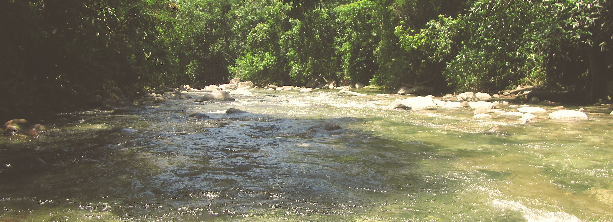

---

---

I study how riverine landscapes and their physical properties structure genetic diversity of organisms within and between river drainages, with special focus on the species rich ichthyofauna of the Neotropics. Applying modeling approaches helps me understand how the process of divergence is potentially linked to multiple and possibly interacting mechanisms, such as geography, ecology, adaptation, and riverine characteristics, and how such genetic structure may link to patterns of species diversity.

I'm a postdoctoral fellow in the Biodiversity Research Centre at University of British Columbia since 2018. I graduated in 2017 from the University of Michigan with a PhD in Ecology and Evolutionary Biology and before I did a Msc in Animal Biology at Universidade Federal do Rio Grande do Sul (Brazil).
  

**There are way too many rivers and fishes out there... so Im slowly building this website.** 
 

####You can find my updated CV [here](files/AndreaThomaz_CV2019.pdf).