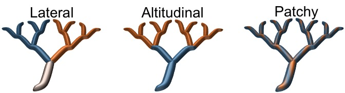

---

---

#Research

    

####Much of my work focuses on the interactions between the environment (i.e., geography, geological history, and physical riverine properties) and species ecological traits generating genetic diversity patterns. With an interdisciplinary framework that combines extensive genetic simulations with empirical data on Neotropical fish, my research explores how riverine environments in particular affect the genetic differentiation of individual populations.

 

Picture on the left brings an example of the high diversity of species we observe on the Atlantic Rainforest in Brazil. With more than 500 species in the area, its a hotspot of diversity.

 

##Spatio-temporal changes in rivers and its effect on evolutionary dynamics
***

###The effect of sea-level changes on genomic differentiation of coastal fishes

Historically, Pleistocene glacial cycles caused pronounced fluctuations in sea level that strongly impacted connectivity among coastal rivers. The sea-level retreat created connections between drainages that are isolated today, forming larger paleodrainages (see picture on the right). 

My PhD dissertation at the University of Michigan identified the formation of these **paleodrainages during the Pleistocene** as the main factor explaining the observed genetic differentiation among populations in a freshwater fish species (Characidae: *Hollandichthys multifasciatus*) in a biodiversity hotspot – the basins along the Atlantic Rainforest of Brazil (Thomaz et al., 2015; Thomaz and Knowles, 2018). This geographic region is ideal for addressing this question because it is formed by a series of isolated basins where freshwater fish have evolved in long-term isolation with a unique biogeographic history, allowing us to interpret biogeographic breaks in this riverine, coastal fish fauna. However, this rich diversity (> 500 sp.) is not evenly distributed among the coastal basins. Given this evidence, I was curious to observe if this pattern could be linked with genomic diversity in response of sea-level changes. So, going further into the paleodrainages model, I demonstrated that **paleodrainages properties have a direct effect on genomic diversity observed within paleodrainages** (Thomaz et al., 2017). However, to clarify the congruency in which the ichthyofauna community is responding to these sea-level changes, I studied how the **interaction between geography in coastal areas and species’ ecological requirements may promote genetic diversification of organisms at regional scales** (Thomaz and Knowles, in review). For this study, I have generated genomic data for four co-occurring species that present contrasting life histories for different river portions (e.g., headwater and lowlands). By applying a comparative phylogeographic approach, I demonstrate that apparent similarity of genetic patterns at the regional scale reflects significant variation in processes occurring at the temporal and local levels, indicating that species with contrasting ecologies responded differently to cyclical changes throughout the Pleistocene.

***
###The effect of riverine landscapes structuring the genetic diversity of organisms within drainages

The effect of landscape properties on patterns of genetic diversity and differentiation is well known for terrestrial organisms thanks to a vast array of tools that have been developed, allowing researchers to model the interaction between genes and space (e.g., isolation by distance, isolation by geography, niche models). However, for riverine environments, which are characterized by a complex dendritic (i.e., treelike) structure, this understanding is still in its infancy. This portion of my research line aims to understand **how riverine landscapes and their physical properties structure the genetic diversity of organisms within drainages given that dispersal is potentially affected by a variety of riverine features**. This research highlights the importance of incorporating riverine properties into phylogeographic studies more broadly. Theoretically, I use **computer simulations** to generate expected patterns of genetic variation so the impact of specific river properties on movement patterns of fish species could be discerned (Thomaz et al., 2016). This framework is being currently expanded during my postdoctoral research to **incorporate adaptive processes, such as ecologically driven divergence on riverine systems** (see picture below). For that, I’m focusing on the distinct local adaptation responses that different spatial environmental heterogeneity scenarios (e.g., temperature, substrate, and watercolor) might generate to build a foundational mechanistic understanding of local adaptation in dendritic environments. Preliminary results indicate the importance of incorporating spatial information in these systems to be able to obtain a signal of local adaptation and estimate the rate of false-positives when performing genome-wide association studies (GWAS).

